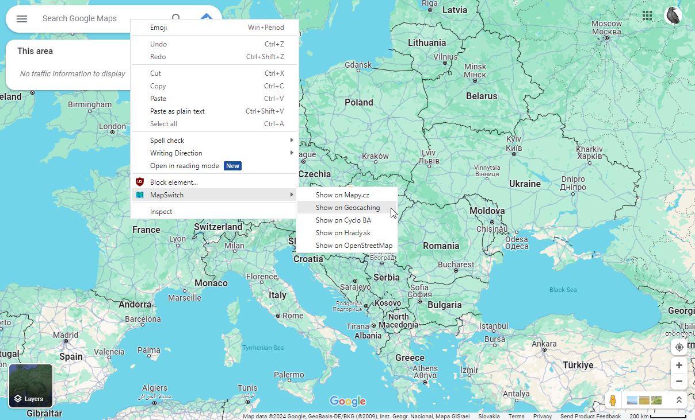

# The Project

MapSwitch 🗺️ is a browser extension that allows you to open a different map in a new tab on the same location (latitude/longitude) as your currently viewed map.

It works in Chromium-based browsers and Firefox.

## How does it work?

* you are browsing a map site like `Google` or `OpenStreetMap`
* right-click somewhere to open your browser's context menu (i.e. not on the map directly, but on some other element)
* click `Show on` the service you want to open
* a new tab will be opened, and the map will be located at the same latitude/longitude with the same level of zoom.

## Release in Chrome Web Store
**I'd love to...** but it seems there's a bug when using Manifest v3 and Google won't accept v2.

With v3, the listeners on those menu item clicks are removed after 30 seconds when the `service worker` is shut down. When you then click on a menu item, it only wakes up the `service worker`, but the event is lost, you have to click a second time. So it basically stops working after 30 seconds of inactivity and needs an extra click to wake it up...

I don't want to introduce any crazy workaround which I then have to maintain.

## How to install locally?

* Clone this GIT repository to your machine, thus having a local "map-switch" folder.

### Chromium (Chrome/Brave/Edge).

* Navigate to extensions (either type `about:extensions` or click on the `three dots/dashes` top right, then `More Tools` and `Extensions`)
* Make sure to have `Developer Mode` enabled (top right)
* Click on the `Load unpacked` button
* Select the `map-switch` folder

### Firefox

* Type `about:debugging`
* Click on `This Firefox`
* Click on the `Load Temporary Add-on...` button
* Select the `manifest.json` file in `map-switch`